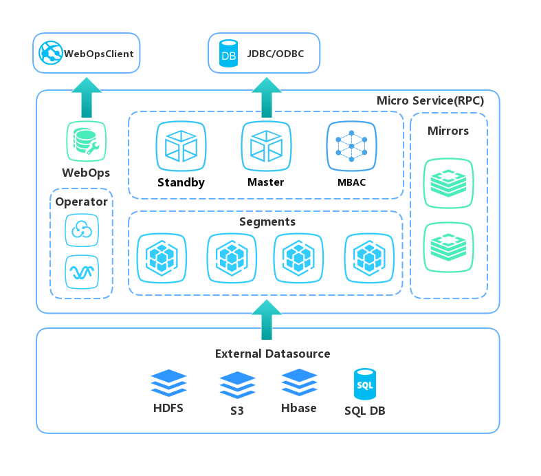

# Greenplum Operator

Greenplum Operator for Kubernetes

## Overview



## Features
- Rolling updates on greenplum  cluster changes
- Volume resize without Pod restarts
- restApi for update the KindSpec of greenplum  cluster


## Getting started


## Documentation


## Examples

- GPDBCluster yaml example

```yaml
apiVersion: gp.sjgs/v1alpha1
kind: GPDBCluster
metadata:
  name: dev-gpdbcluster
spec:
  masterAndStandby:
    replicas: 1
    image: gpnode
    storageClassName: nfsclient
    storage: 1Gi
    hostBasedAuthentication: |
       host   all   gpadmin   0.0.0.0/0   md5
       host   all   gpuser    0.0.0.0/0   md5
       host   all   all    0.0.0.0/0   md5
  segments:
    replicas: 2
    image: gpnode
    storageClassName: nfsclient
    storage: 2Gi
  mirrors:
    replicas: 2
    image: gpnode
    storageClassName: nfsclient
    storage: 2Gi
  masterSelector: master-1
```

## Community

```

```
